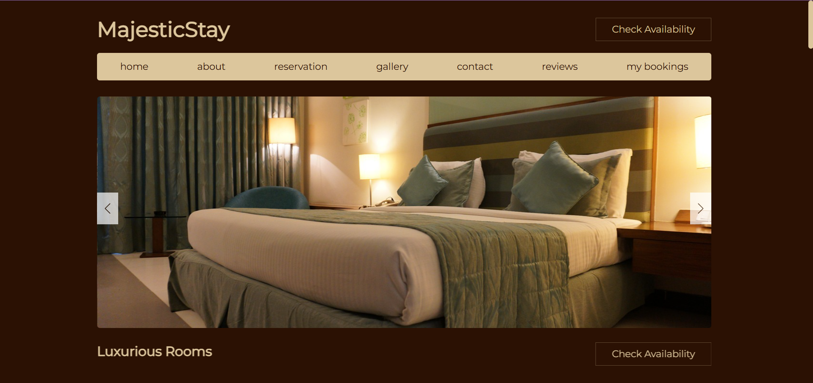
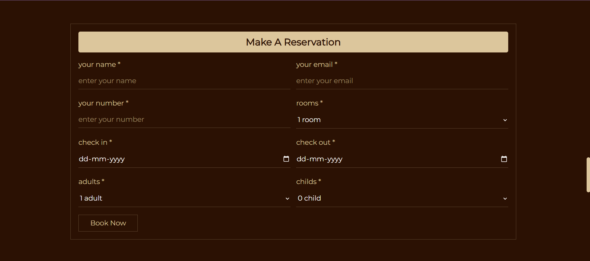
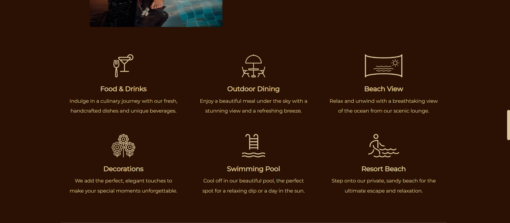
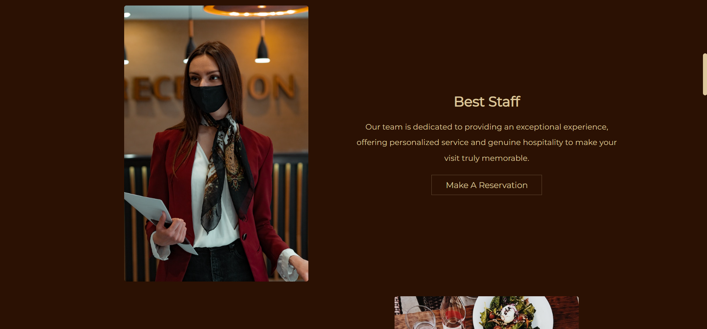
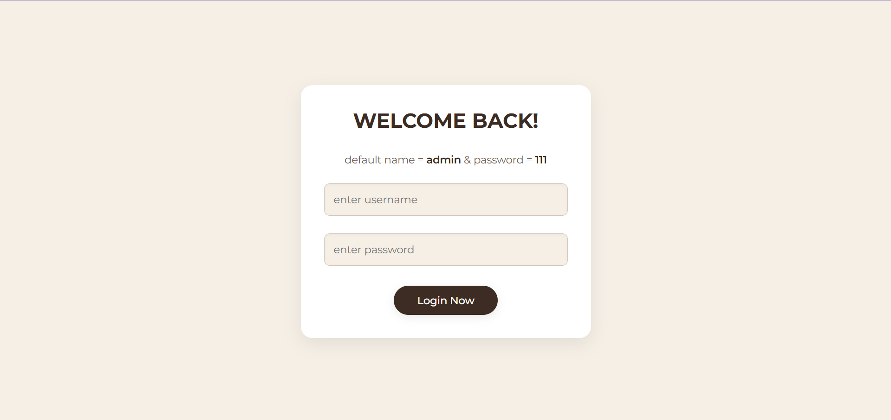
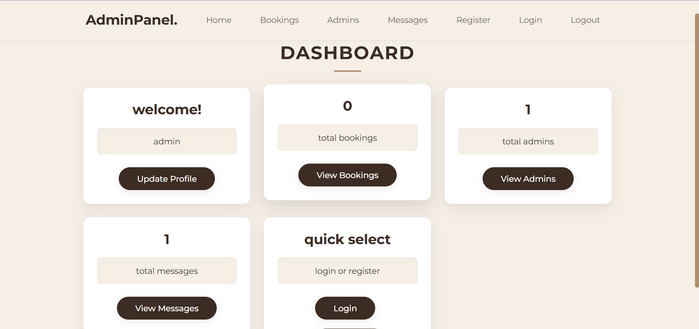
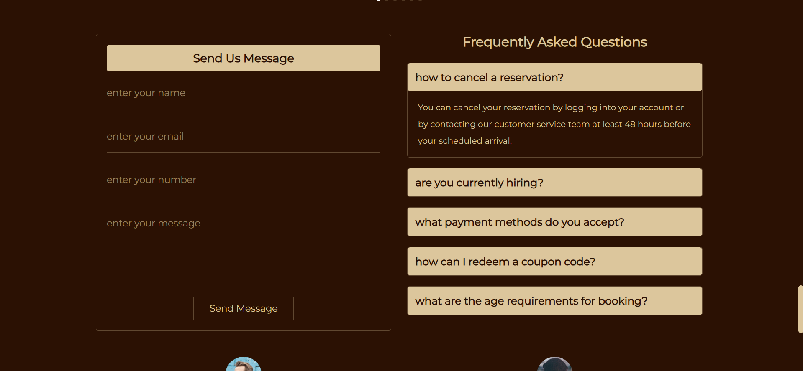

MajesticStay Hotel Booking 🏨
This is a professional and elegant website for a hotel booking system, built with PHP and MySQL. It's designed to provide a seamless and secure experience for both guests and administrators.

✨ Features
-User-friendly Interface: A clean and modern design for an effortless booking experience. 🖥️
-Room Availability: Users can easily check room availability for specific dates. 🗓️
-Booking Management: A secure system to handle user reservations and data. 🔒
-Contact Form: Guests can send messages and inquiries directly to the hotel staff. 📧

🚀 Installation
1)Clone the repository to your local machine.
  git clone https://github.com/sushmag0wda/MajesticStay.git

2)Set up the database.
  -Create a new database named hotel_db.
  -Import the hotel_db.sql file into your database.

3)Place the project files in your web server's root directory (e.g., htdocs for XAMPP).

4)Update the database connection.
-Open project/components/connect.php and update the database credentials if necessary.

📸 Screenshots
User Pages

Home Page

Reservation Page

Services Page

About Page

Gallery Page

Admin Pages

Admin Login Page

Admin Dashboard

Admin Messages

