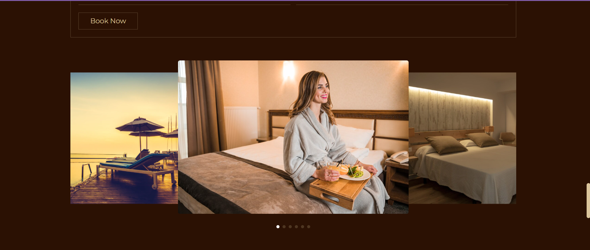

# 👑 MajesticStay Hotel Booking 🏨

A professional and elegant hotel booking system built with **HTML**, **CSS**, **JS**, **PHP**, and **MySQL**, designed to provide a seamless and secure experience for both guests and administrators.

---

## ✨ Key Features

- **User-Friendly Interface:** Clean and modern design for effortless booking. 🖥️
- **Room Availability:** Easily check room availability for specific dates. 🗓️
- **Booking Management:** A secure system to handle user reservations and data. 🔒
- **Contact Form:** Guests can send messages and inquiries directly to hotel staff. 📧

---

## 📸 Screenshots

### **User Pages**

**Home Page**

**Reservation Page**

**Services Page**

**About Page**

**Gallery Page**

**Messages Page**

### **Admin Pages**

**Admin Login Page**

**Admin Dashboard**

